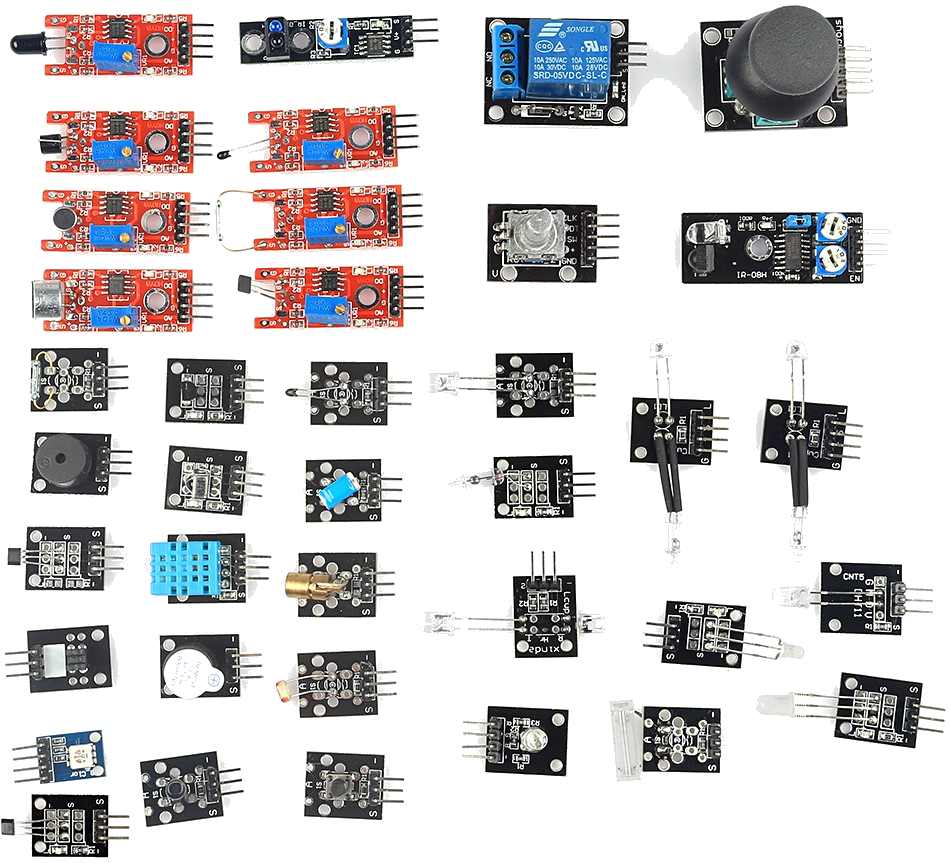

# Curso Superior de Innovación Pedagógica y Metodologías para el Aprendizaje.

## Módulo de Programación y Robótica.

### José Antonio Vacas @javacasm

# Equipos

## MakeBlock

Es un mecano con corazón de Arduino.

Programable con bloques

[Recursos](https://www.makeblock.es/soporte/robot-mbot/)

[Empezando con MakeBlock](https://programamos.es/conoce-la-interfaz-de-mblock-y-programa-los-primeros-pasos-de-tu-mbot/)

## [Makey-Makey](./MakeyMakey.md)

## Bq

## Lego

## BeeBot

## Meccanoid

# Problemas y sus soluciones

## El coste

Uno de los problemas que se plantea cuando se quiere hacer robótica en el aula es que tiene el coste y que normalmente los centros no disponen de presupuesto para ello.
En ese punto siempre aparece la disyuntiva de si usar un kit o los componentes

Por un lado un kit es sencillo de usar pero costoso

Por otro lado los componentes son baratos pero difíciles de usar

Una posible solución consiste en  involucrar a distintos niveles con distintas capacidades y dándoles tareas con distinto nivel de dificultad

Al construir el kit estamos aprendiendo electrónica, soldadura, impresión 3D, a leer esquemas,.... y estamos fabricando los componentes que pueden usar los más pequeños
