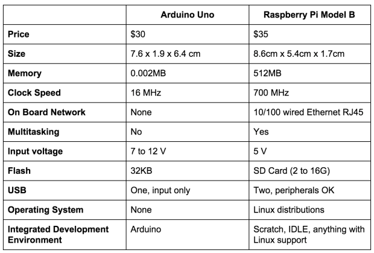
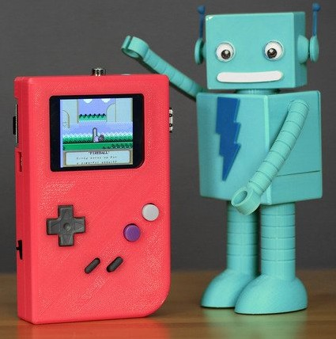

# Curso Superior de Innovación Pedagógica y Metodologías para el Aprendizaje.

## Módulo de Programación y Robótica.

### José Antonio Vacas @javacasm

# Raspberry

La versión más actual es la [Versión 3](https://www.raspberrypi.org/products/raspberry-pi-3-model-b/) (1.2GHz quad core 1Gb Wifi y bluetooth)

y la versión [Zero](https://www.raspberrypi.org/products/pi-zero/) (1Ghz 512Mb)

Puedes encontrar más detalles en la [página de la wikipedia]([Artículo de la wikipedia sobre RaspBerry Pi](https://en.wikipedia.org/wiki/Raspberry_Pi)

## Raspberry Pi vs Arduino

Una pregunta muy frecuente es si para determinado proyecto es mejor usar Arduino o Raspberry Pi.

* Arduino es más robusto eléctricamente
* Arduino dispone de entradas analógicas
* Raspberry Pi tiene una mayor capacidad de procesamiento

  

## Proyectos

Vamos a ver algunos proyectos donde se usa una (o varias) Raspberry Pi

### Enseñanza

Existen [distribuciones  educativas](https://learn.adafruit.com/adafruit-raspberry-pi-educational-linux-distro)

Podemos montar [Aulas informatica](https://www.raspberrypi.org/blog/bringing-computing-to-rural-cameroon/)

### Instrumentación de Laboratorio

Añadiendo algo de hardware externo podemos utilizarlo como equipamiento de laboratorio.

* Generadores de onda
[DAC](https://learn.adafruit.com/mcp4725-12-bit-dac-with-raspberry-pi)

  

* [Analizador de precuencias](https://learn.adafruit.com/freq-show-raspberry-pi-rtl-sdr-scanner)

  

### Robots

[Raspberry y Lego Minstorm](https://learn.sparkfun.com/tutorials/getting-started-with-the-brickpi?_ga=1.260570443.733603098.1443800444)

### [Minecraft](https://learn.adafruit.com/running-minecraft-on-a-raspberry-pi)

Juega a MineCraft desde tu RaspBerry Pi

### [Kano: portátil  basado en raspberrypi](http://www.raspberrypi-spy.co.uk/2016/04/kano-computer-kit-first-impressions/)

## Cámara

[SnapPiCam](https://learn.adafruit.com/snappicam-raspberry-pi-camera)

## Máquina de juegos

Uno de los usos más frecuentas de la Raspberry es para jugar, su pequeño tamaño y su capacidad la hacen ideal.

* [Mame](https://learn.adafruit.com/retro-gaming-with-raspberry-pi?view=all) (Emulador de máquinas recreativas antiguas)

  

* [Mini máquina recreativa](https://learn.adafruit.com/cupcade-raspberry-pi-micro-mini-arcade-game-cabinet?view=all) aprovechando si mini-tamaño

  

* [Cómo instalar y jugar al clásico videojuego  Doom](https://learn.sparkfun.com/tutorials/setting-up-raspbian-and-doom?_ga=1.227922267.733603098.1443800444)

  

### Juegos Portables

[Raspberry Pi Gameboy](https://learn.adafruit.com/pigrrl-raspberry-pi-gameboy?view=all)

[Super consola](https://learn.adafruit.com/super-game-pi?view=all)

[Retro consola](https://www.instructables.com/id/Breadboard-RetroPie/)

## Teléfono

[RaspiPhone es un teléfono basado en Raspberry Pi](https://learn.adafruit.com/piphone-a-raspberry-pi-based-cellphone?view=all)

* [MiniPortatil](https://learn.adafruit.com/mini-raspberry-pi-handheld-notebook-palmtop)

## Documentación sobre Raspberry Pi

### Revistas

La principal revista (mensual) sobre Rasperry Pi es [The MagPy](https://www.raspberrypi.org/magpi/). Es una fuente de información extraordinaria, repleta de proyectos y consejos. Se puede descargar gratuitamente pero si compras la edición en papel suele traer regalos. El famoso número 40 de la revista ¡regalaban un Rasperry Pi Zero! por los 5€ que cuesta. Ni que decir tiene que se agotó rápidamente.

Puedes descargar [todos los números](https://www.raspberrypi.org/magpi/issues/) directamente.

También ha creado un [libro de proyectos](https://www.raspberrypi.org/magpi/raspberry-pi-projects-book-2/)

### Tutoriales

Algunos tutoriales para aprender rápidamente a manejar tu Raspberry Pi

[Raspberry pi Class (instructables)](http://www.instructables.com/class/Raspberry-Pi-Class/?utm_source=newsletter&utm_medium=email)

[Vídeo tutorial Raspberry Pi (sparkfun)](https://www.youtube.com/watch?v=b6h95jNWg1g)

[Vídeo tutorial Raspberry Pi 2 (sparkfun)](https://www.youtube.com/watch?v=jmPgdcec53s)

[Tutoriales de Adafruit](https://learn.adafruit.com/search?q=raspberry)

[Tutoriales de sparkfun](https://www.sparkfun.com/search/results?term=raspberry)
